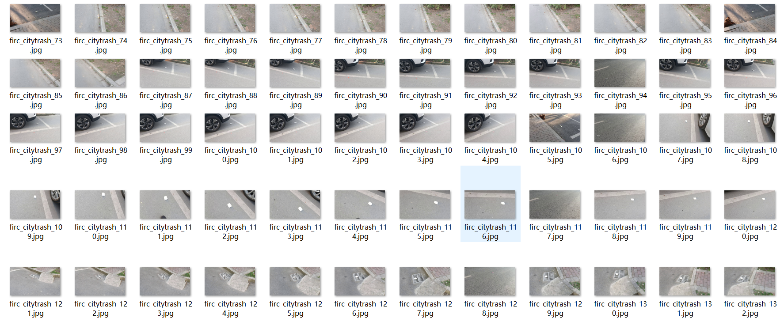
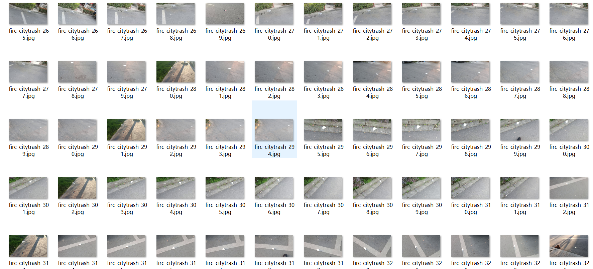
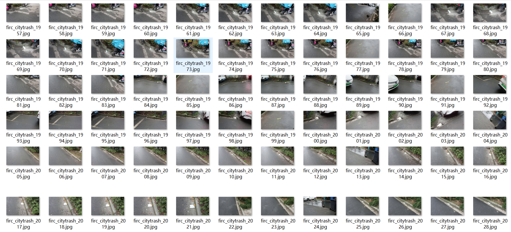

# [Object Detection Dataset] City Street Garbage Detection Dataset VOC+YOLO format

5266 images, 33-class

Dataset format: Pascal VOC format + YOLO format (without split path's txt file, just contains jpg images and corresponding VOC format xml files and YOLO format txt files)

Number of images (jpg files): 5266

Number of annotations (xml files): 5266

Number of annotations (txt files): 5266

Number of categories: 33

Annotation category names: ["xiangyanhe", "yilaguan", "zhi", "other", "lajidui", "weishengzhi", "suliao", "zhihe", "suliaobei", "shuye", "xiguan", "guopi", "yantou", "kouzhao", "shoutidai", "pingzi", "bu", "zhidai", "gutou", "zhiwan", "caiye", "paomo", "dahuoji", "zhibei", "pinggai", "shitou", "shepidai", "zhixiang", "xiyiyehe", "zhuhe", "jinshu", "guan", "kuaizi"]

Number of bounding boxes per category:

bu (cloth strip) = 113

caiye (vegetable leaf) = 7

dahuoji (matchbox) = 20

guan (pipe) = 27

guopi (national peace) = 53

gutou (bone) = 17

jinshu (metal product) = 27

kouzhao (mask) = 384

kuaizi ( chopsticks) = 29

lajidui (garbage pile) = 112

other (other waste) = 431

paomo (plastic foam) = 96

pinggai (bottle cap) = 36

pingzi (bottle) = 345

shepidai (snakeskin bag) = 19

shitou (stone) = 21

shoutidai (handbag) = 29

shuye (leaves) = 37

suliao (plastics) = 1901

suliaobei (plastic cup) = 73

weishengzhi (tissue paper) = 585

xiangyanhe (cigarette box) = 686

xiguan (sucking straw) = 1

xiyiyehe (detergent box) = 31

yantou (cigarette butt) = 229

yilaguan (aluminum can) = 155

zhi (paper items) = 804

zhibei (paper cup) = 41

zhidai (paper bag) = 126

zhihe (paper box) = 367

zhiwan (paper bowl) = 65

zhixiang (carton) = 25

zhuhe (bamboo box) = 5

Total bounding boxes: 6897

## Images

---

Here is a pay link on Stripe (https://buy.stripe.com/3cs8yP7sY87d0vu9AB). Please contact me lonlonago@foxmail.com after funding $89, and I will send you a complete data files, thank you!

